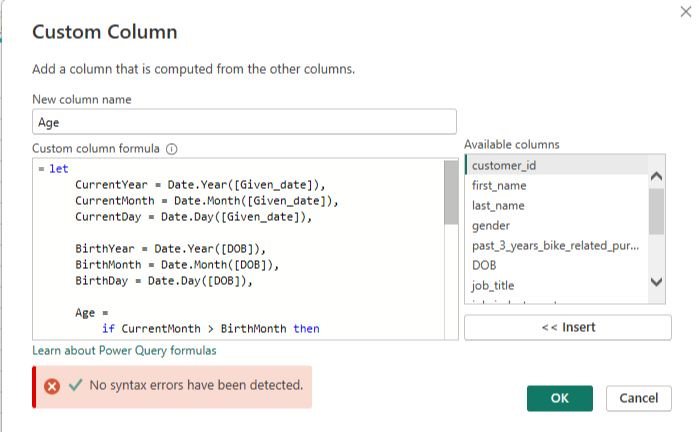
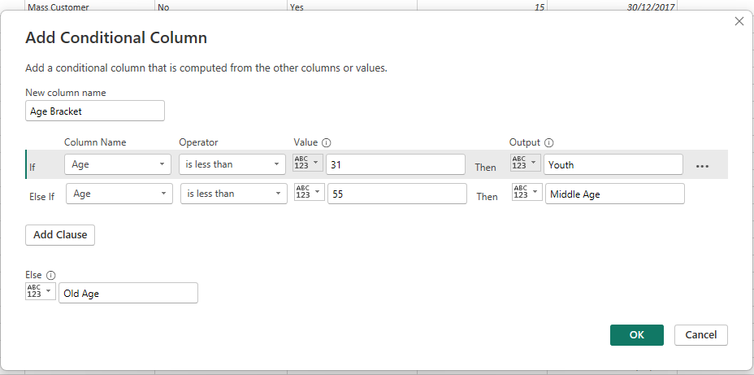
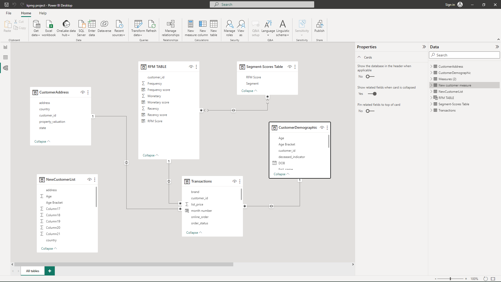
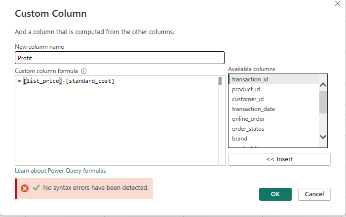
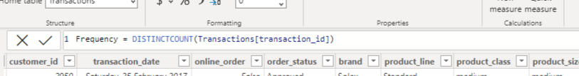
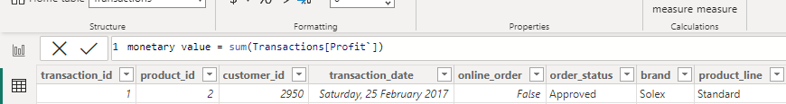
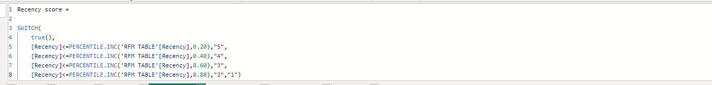
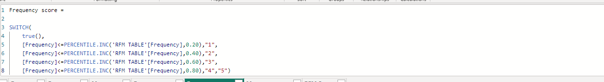
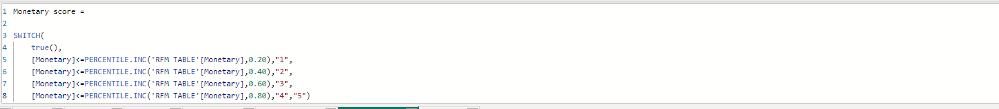
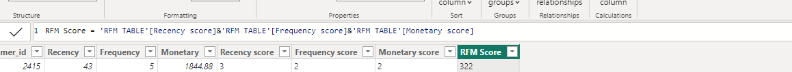

# Customer-Analysis

## Introduction
Welcome to the documentation of my KPMG Virtual internship in data analysis. Throughout this internship, I had the privilege of working with four diverse datasets: customer demographic, customer address, transaction, and new customer datasets where the client was Sprocket Central Pty Ltd. This documentation aims to provide a comprehensive overview of the methodologies, analyses, and insights derived from my exploration and manipulation of these datasets. As you delve into the following pages, I hope you will gain valuable insights into the world of data analysis and the impact it can have on business decision-making processes
## Problem Statement
1.	Assessment of data quality and completeness in preparation for analysis.
2.	Targeting high value customers from the 1000 customers from sprocket central Pty Ltd based on the datasets given.
3.	Dashboard presentation which should include the customers sprocket central Pty Ltd should be targeting.
## Data Source
The datasets were obtained from our client, Sprocket Central Pty Ltd. They served as the clients for the project conducted during the virtual internships with KPMG.
### Data Quality Assessment

| Dataset            | Data Quality Issues                                     | Recommended Actions                                      |
|--------------------|---------------------------------------------------------|-----------------------------------------------------------|
| Customer Demographic |  Inaccurate DOB                                       |  Verify and correct inaccurate Date of Birth entries    |
|                     |  Missing Age                                          |  Address missing Age values                             |
|                     |  Missing job titles                                   |  Validate and complete missing job titles               |
|                     |  Missing Customer IDs                                 |  Validate and complete missing Customer IDs             |
|                     |  Inconsistent Gender                                  |  Standardize data entries in the Gender column          |
|                     |  Unnecessary/null-filled columns                      |  Identify and remove irrelevant columns                 |
| Customer Address    |  Missing Customer IDs                                 |  Address missing Customer IDs                           |
|                     |  Inconsistent states                                  |  Rectify inconsistent entries in the states column      |
| Transaction         |  Missing Profit column                                |  Ensure the Profit column is appropriately populated    |
|                     |  Incomplete Customer IDs                              |  Rectify incomplete entries in the Customer ID          |
|                     |  Incomplete Online Order flag                         |  Rectify incomplete entries in the Online Order flag     |
|                     |  Blank Brand information                              |  Rectify incomplete entries in the Brand information    |
|                     |  Incorrect List Price format                          |  Correct the List Price attribute format                |
|                     |  Incorrect Product Sold Date format                   |  Correct the Product Sold Date format                   |

## Data Cleaning and Transformation
Consistency within the dataset was improved, F in the gender column was replaced with Female, Femal was replaced with Female, M was replaced with Male, null values in the job title column was replaced with not specified. N was replaced with No, Y with Yes in the owns_car column. Same thing was repeated for the deceased_indicator column. New South wales was replaced with NSW, Victoria was replaced with VIC.

Several data transformations were performed on our dataset to ensure its readiness for analysis. Among these transformations, I generated an "age" column based on the provided "date of birth" information. To calculate the age from the date of birth, I used the last transaction date available in the dataset, which was identified as 30/12/2017 using the maximum function. Consequently, a new column was created to store this date, and the age column was generated using the following code: 

.

A new "age bracket" column was introduced, encompassing three distinct categories: "Youth," "Middle Age," and "Old Age." Individuals falling within the age range of 0 to 30 years were assigned to the "Youth" category. Those between 31 and 54 years were classified under the "Middle Age" category, while individuals aged 55 years and above were grouped into the "Old Age" category. This classification scheme helps to better analyze and understand the distribution of age groups within our dataset.

.
## Data Modelling
For the modelling, a snowflake schema design was utilized to connect all tables with the exception of the ‘Newcustomerlist’ table. The decision to exclude this table from establishing relationships with other four tables was made due to its lack direct association with the other table. The modelling of the tables is shown below

.
## Data Analysis and Exploration
To commence the analysis, I thoroughly reviewed the datasets, and it became evident that conducting a customer segmentation analysis specifically on our old customers from the transaction dataset would be essential. I used RFM Analysis to segment the customers based on their RECENCY, FREQUENCY and MONETARY VALUE (RFM). Additionally, we should perform various other analyses to identify the factors influencing sales in terms of revenue and quantity for the company. The customer segmentation analysis will help us categorize our old customers into distinct groups based on their behavior, preferences, and historical transaction patterns. This segmentation will allow us to tailor marketing strategies and enhance overall customer satisfaction and loyalty.

Furthermore, we will explore other analyses to uncover the drivers behind sales performance in terms of both revenue and quantity. This will include the gender, examining product-specific trends, location, age brackets, wealth segment, job industry and owning a car. By identifying the influential factors, we can make informed decisions to optimize sales and improve overall business performance.

I noticed that a profit column was not created and I created the profit column. To calculate the profit for each transaction in the dataset, the difference between the list price and the standard cost on the  transaction dataset was computed. This was achieved using the following code

.
#### RFM ANALYSIS
To initiate our RFM (Recency, Frequency, Monetary) analysis, we first computed the recency metric. The reference date for recency calculations was established as 30/12/2017, which was the latest date available in the dataset.

To determine the recency for each customer, we calculated the difference in days between the last transaction date associated with their customer ID and the reference date (30/12/2017). This approach allows us to ascertain the time elapsed since the customer's most recent purchase. To get the last transaction date for each customer ID, a measure was created with the code below:

With this measure, the recency for each customer was obtained by calculating the difference in days between the last transaction date and the reference date (i.e., 30/12/2017), which was used as the point of reference for the analysis and this was obtained using the code below;
.
To calculate the frequency value for each customer, we performed a distinct count of transaction IDs associated with each customer. This process involved counting the number of unique transaction IDs for each individual customer.
By determining the frequency of transactions made by each customer, we gain insights into their purchase habits and engagement with the company. This frequency value will be an essential component of our RFM (Recency, Frequency, Monetary) analysis, allowing us to segment customers based on their transactional behavior.

.

To calculate the monetary value for each customer, we summed the profit generated by all the transactions associated with each customer. This process involved aggregating the individual profits for all transactions made by a particular customer.
By computing the monetary value, we can gauge the total revenue generated from each customer's transactions. This metric is crucial in understanding the overall contribution of each customer to the company's revenue stream and this was obtained using the code below;

.

The RFM table was created, containing the recency, frequency, and monetary values calculated earlier, grouped by customer ID. To assign recency scores, the recency values were divided into five percentiles, with the lowest recency values receiving the highest percentile scores. This approach ensures that recent customers are graded higher due to their lower recency values. The same percentile-based scoring was applied to calculate frequency and monetary scores. By combining the three scores, the RFM Score was obtained, providing a comprehensive metric for customer segmentation based on their recency, frequency, and monetary value contributions. This scoring system enables targeted marketing strategies and personalized customer engagement efforts to enhance satisfaction and overall profitability.

recency score  
  
frequency score                    
  
monetary score

Indeed, after obtaining the individual recency, frequency, and monetary scores, the three scores are concatenated to generate the RFM Scores for each customer. This concatenation involves combining the three scores into a single string or numeric value that represents the complete RFM Score.
   
## Data Visualization and Insights
During the analysis, visualizations were utilized to gain insights into how various variables influence sales within the company. Several measures were created, including the total number of customers, the number of males, the number of females, and the total bike-related purchases.
Based on the analysis done and visualization, the following factors can be considered to target new customers effectively:

1. According to the RFM analysis, it is evident that the segment categorized as "Champions" played a pivotal role in driving the overall profit, accounting for approximately 22% of the total profits. Remarkably, this group constitutes merely 6% of the total customer base. Following closely, the "At Risk" customer segment emerged as another substantial contributor, responsible for around 17% of both the total profit and the customer count. Interestingly, the largest customer group, classified as "Potential Loyalists," holds significant potential due to their sheer numbers. Despite this, their current contribution to the total profit stands at approximately 9%. This observation could potentially open avenues for further exploration to harness the latent value within this expansive segment.

2.	Industry Sector: Target customers within the manufacturing, finance, and health sectors, as they have shown the highest contribution to the total profit. Manufacturing industry contributed about 24.27% to the total profit, finance industry about 24.02%, and health sector about 18.56%. Tailoring marketing efforts to address the specific needs and preferences of customers in these sectors can lead to increased engagement and loyalty.

3.	Age Group: Focus on the middle-age group, as they have proven to be the largest contributors to the total profit, contributing about 60%. The youth category followed with approximately 25%, while the old age category contributed the lowest with about 15%. By understanding the preferences and behavior of this age group, targeted marketing campaigns can be designed to appeal to their interests.

4.	Wealth Segment: Concentrate efforts on mass customers, as they have demonstrated the highest contribution to the total profit, contributing about 50%. Additionally, targeting high net worth customers (26%) and affluent customers (24%) can also be beneficial, as they contribute significantly to the overall profitability of the company.

5.	Geographic Region: Direct marketing initiatives towards customers in New South Wales (NSW), as this region has contributed the highest percentage to the total profit, accounting for about 53%. Tailoring promotions and offers specific to the NSW market can yield positive results. The VIC state contributed about 25%, and QLD contributed 22% to the total profit.

6.	Consider Car Ownership and Gender: Based on the analysis, it was observed that there were no significant differences in past bike-related purchases and total profit between genders and car owners/non-owners. The variations within the different groups of these variables were found to be less than 2%. Given the minor differences in bike-related purchases and total profit based on car ownership and gender, it may not be a significant factor to consider when targeting high-value customers. Instead, focusing on the other critical factors, such as industry sector, age group, wealth segment, and geographic region, which have demonstrated substantial contributions to the total profit, would be more effective in tailoring marketing strategies.

By prioritizing the factors with notable impacts on sales and profitability, the company can optimize its resources and efforts to achieve better customer engagement, loyalty, and overall business success. Continuous monitoring of customer behavior and preferences will still be valuable to identify any shifts or changes in customer trends over time.

By leveraging these detailed insights, the company can implement data-driven marketing strategies that resonate with target customers and enhance customer acquisition, retention, and overall profitability. Continuous monitoring and analysis of customer data will be crucial in adapting strategies over time and staying ahead in a competitive market. 
## Analysis of new customers
 The insights obtained from analyzing the new customers dataset and creating visualizations reinforce our initial conclusions about factors to consider when targeting new customers. Here are the key findings based on the visuals: 
1. Age Bracket: Similar to the existing customer dataset, the middle age group also contributes the highest to the total bike-related purchases among new customers. Targeting marketing efforts towards this age group can be a strategic approach to attract and engage new customers.
2. Wealth Segment: As with existing customers, the mass customers among new customers also exhibit the highest contribution to bike-related purchases. Focusing on this segment in marketing initiatives can be advantageous in driving sales and revenue.
3. State: Consistent with the existing customer dataset, New South Wales (NSW) emerges as the state with the highest contribution to bike-related purchases among new customers, accounting for approximately 50% of the total. Targeting marketing efforts specifically to the NSW region can be beneficial in maximizing sales.
4. Job Industries: Similar to the existing customers, the finance, manufacturing, and health job industries also lead the way in bike-related purchases among new customers. Concentrating on customers from these industries may result in increased sales and profitability.
5. Gender and Car Ownership: The analysis reaffirms that gender and car ownership continue to exhibit minimal differences in bike-related purchases among new customers. As the variations in these factors are less than 2%, they may not significantly influence the decision to target high-value customers.

In summary, the insights gained from analyzing the new customers dataset and visualizations align with the earlier findings. Prioritizing the middle age group, mass customers, customers from NSW (New South Wales), and those in finance, manufacturing, and health industries remains a sound strategy for targeting new customers effectively. While gender and car ownership may not be decisive factors in targeting high-value customers, continuous monitoring of customer behavior and preferences is essential to adapt strategies as customer trends evolve over time. By leveraging these insights, the company can tailor marketing approaches to resonate with potential customers and drive business growth.
Based on the earlier analysis and filtering criteria, the table of targeted customers consists of 68 individuals who meet the specified conditions from the 1000 new customers. These customers exhibit the following characteristics:
1. Location: They reside in the New South Wales (NSW) state.
2. Wealth Segment: They belong to the mass customers' wealth segment.
3. Age Bracket: They fall within the middle age bracket.
4. Job Industry: They work in the manufacturing, finance, or health industry.
The table includes the first name, last name, address, state, wealth segment, and job industry for each of the 68 targeted customers. These individuals have been identified as potential high-value customers based on the analysis conducted earlier, and they present valuable opportunities for targeted marketing and engagement efforts.

By focusing on this select group of customers, the company can allocate resources more effectively, deliver personalized offers, and improve customer satisfaction. Implementing tailored marketing strategies for these targeted customers will likely yield higher conversion rates and contribute positively to the company's overall revenue and growth.

